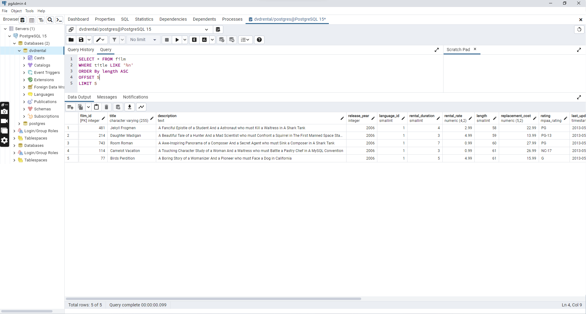
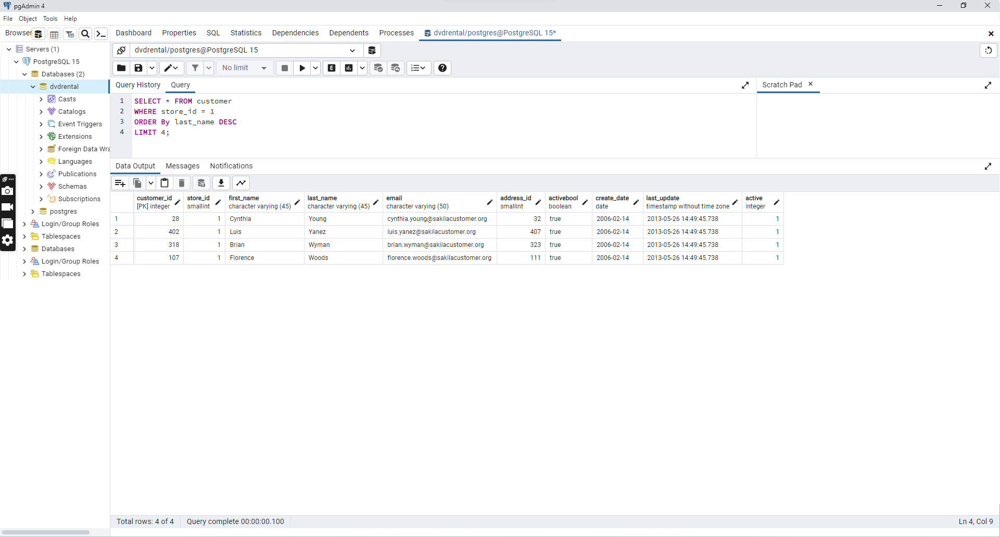

# ORDER BY
- ORDER BY anahtar kelimesi sayesinde bizler verilerimizi herhangi bir sütunda bulunan değerlere göre azalan veya artan bir şekilde sıralayabiliriz.

## ORDER BY Söz Dizimi
```
SELECT <sütun_adı>, <sütun_adı>, ...
FROM <tablo_adı>
ORDER BY <sütun_adı>, <sütun_adı>, ... ASC|DESC;
```
## ORDER BY Örnek Kullanım
```
SELECT *
FROM film
ORDER BY title (ASC);
```
- Bu sorgumuzda dvdrental veritabanında bulunan film tablosundaki tüm sütunları title sütununda bulunan verilere göre artan (ASC) şeklinde sıralıyoruz.

- ASC sıralama varsayılan olduğu için ayrı bir şekilde yazılması zorunluluğu yoktur ancak sorguyu belirginleştirmesi açısından genelde yazılır.
```
SELECT *
FROM film
ORDER BY title ASC length DESC;
```
- Sıralama birden fazla sütuna göre de yapılabilir. Yukarıdaki örneğimizde sıralama title sütununa göre artan length sütununa göre azalan şeklinde yapılıyor.
```
SELECT *
FROM film
WHERE title LIKE 'A%'
ORDER BY title ASC length DESC;
```
- Yukarıdaki örneğimizde de gördüğümüz gibi sıralama işlemi, koşuldan sonra yazılır.


## LIMIT ve OFFSET
 # LIMIT
- Şimdiye kadar yaptığımız SQL sorgularında genellikle verilerin tamamını belirli koşullar altında sıraladık. Bazı durumlarda ise koşullarımızı sağlayan verilerin tamamını değil belirli sayıda olanlarını sıralamak isteriz, bunun için LIMIT anahtar kelimesini kullanırız.

- Şöyle bir senaryo üzerine düşünelim. dvdrental veritabanında bulunan film tablosundan B ile başlayan filmleri uzunluklarına göre en uzun olan 10 filmi sıralayalım.
```
SELECT *
FROM film
WHERE title LIKE 'B%'
ORDER BY length DESC
LIMIT 10;
```
- Yukarıdaki sorgumuzda da görmüş olduğunuz gibi önce koşullamayı, sonra gruplamayı en son ise LIMIT kullanarak istediğimiz veri sayısını belirttik.

## OFFSET
- Bazı durumlarda sonuç olarak gördüğümüz veri grubu içerisinden bazılarını "pass" geçmek isteriz. Yukarıdaki senaryomuzu tekrar düşünelim, dvdrental veritabanında bulunan film tablosundan B ile başlayan filmleri uzunluklarına göre sıralayalım ancak en uzun 6 filmi "pass" geçelim ve sonrasındaki 4 filmi sıralayalım. Bu durumda LIMIT 4 ve OFFSET 6 olacak.
```
SELECT *
FROM film
WHERE title LIKE 'B%'
ORDER BY length DESC
OFFSET 6
LIMIT 4;
```
[-- film tablosunda bulunan ve film ismi (title) 'n' karakteri ile biten en uzun (length) 5 filmi sıralayınız.](png/1.png)


[-- film tablosunda bulunan ve film ismi (title) 'n' karakteri ile biten en kısa (length) ikinci(6,7,8,9,10) 5 filmi(6,7,8,9,10) sıralayınız.](png/2.png)


[-- customer tablosunda bulunan last_name sütununa göre azalan yapılan sıralamada store_id 1 olmak koşuluyla ilk 4 veriyi sıralayınız.](png/3.png)
